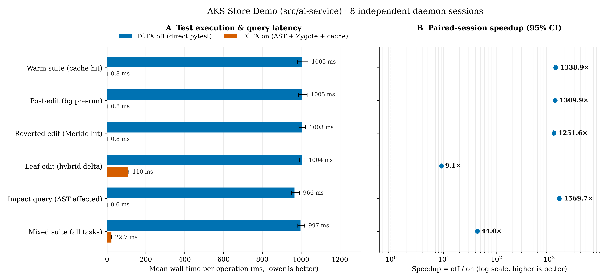

# Pytest Efficacy Benchmark: TCTX Off versus On (`aks-store-demo`)

## Result and Scope

Across **8 independent daemon sessions** (320 paired observations) targeting the Python FastAPI service (`src/ai-service`) of [`aks-store-demo`](https://github.com/dotnetpower/aks-store-demo):

Measured with the `v0.1.3` release build. Exact source-tree and binary hashes are
recorded in [results.json](../benchmarks/results/aks-store-demo/results.json).

- **Warm suite re-execution (`warm_suite`)**: **1003.56 ms without TCTX** vs **0.60 ms with TCTX** (**1,678.37× speedup**, 95% CI **1,614.88–1,739.86×**; median **1001.24 ms → 0.59 ms**).
- **Post-edit speculative background run (`bg_speculative`)**: When a router (`src/ai-service/routers/description_generator.py`) is edited and the background worker verifies affected tests and Ruff rules while the developer or AI coding agent is reasoning, the subsequent `test_run` call takes **0.58 ms** (median **0.57 ms**) vs **1005.19 ms** for direct `pytest` (**1,746.85× speedup**, 95% CI **1,684.33–1,803.58×**).
- **Reverted edit Merkle cache hit (`merkle_revert`)**: Reverting a source edit back to a previously verified state hits the content-addressed SHA-256 Merkle `dep_hash` history in **0.61 ms** (median **0.58 ms**) vs **1018.31 ms** (**1,673.58× speedup**, 95% CI **1,617.33–1,724.02×**).
- **Immediate 0ms-delay leaf edit (`leaf_delta`)**: Calling `test_run` immediately (0 ms delay) after editing an isolated leaf helper skips 3 cached test files and runs only the 1 affected test file via the **Warm Pytest Fork Zygote (`os.fork()` with safe preloads, explicit plugin manifest, bounded output pipes, process-group cancellation, dynamic data-dependency capture, and source-stability verification)** in **86.92 ms** (median **83.58 ms**) vs **1007.86 ms** (**11.59× speedup**, 95% CI **11.16–11.99×**).
- **Impact analysis + Ruff pre-check (`affected_graph`)**: Querying affected tests and cached Ruff diagnostics via the in-memory Rust AST reverse dependency graph takes **0.51 ms** (median **0.51 ms**) vs **967.67 ms** for `pytest --collect-only` (**1,896.02× speedup**, 95% CI **1,853.63–1,948.43×**).
- **Fixed mixed suite (`all`, 320 pairs)**: **1000.52 ms off → 17.84 ms on** (**56.07× mean speedup**, 95% CI **54.19–57.75×**, and **1,713.42× median speedup** from **993.16 ms to 0.58 ms**).



| Task | Pairs | TCTX off mean | TCTX on mean | Off median | On median | Speedup [95% CI] |
|---|---:|---:|---:|---:|---:|---:|
| Warm suite (`warm_suite`) | 64 | 1003.56 ms | 0.60 ms | 1001.24 ms | 0.59 ms | 1678.37× [1614.88, 1739.86] |
| Post-edit bg pre-run (`bg_speculative`) | 64 | 1005.19 ms | 0.58 ms | 1004.63 ms | 0.57 ms | 1746.85× [1684.33, 1803.58] |
| Reverted edit (`merkle_revert`) | 64 | 1018.31 ms | 0.61 ms | 999.07 ms | 0.58 ms | 1673.58× [1617.33, 1724.02] |
| Immediate leaf delta (`leaf_delta`) | 64 | 1007.86 ms | 86.92 ms | 998.43 ms | 83.58 ms | 11.59× [11.16, 11.99] |
| Impact query (`affected_graph`) | 64 | 967.67 ms | 0.51 ms | 950.85 ms | 0.51 ms | 1896.02× [1853.63, 1948.43] |
| Fixed mixed suite (`all`) | 320 | 1000.52 ms | 17.84 ms | 993.16 ms | 0.58 ms | 56.07× [54.19, 57.75] |

## Cold Start Behavior


On a cold cache (first run in a brand-new daemon session with no cached `dep_hash` entries), TCTX performs Python/pytest/plugin environment fingerprinting, builds the AST graph, captures initial runtime data dependencies, and executes all 4 test files. In this run, the full safety setup averaged **707.73 ms** vs **994.09 ms** for direct `pytest` (**1.40× faster**). Cold-start results remain environment-sensitive; the sustained claim is the content-addressed reuse demonstrated by the paired warm and edit scenarios.

## Cache-Disabled Execution Review

A separate local before/after probe compared build `d53b4a6` with the optimized runner.
Background execution was disabled and every request used `no_cache=true`; assertions checked
the number of executed files and passing tests. A two-file fixture imported Pydantic and HTTPX
without making network requests. Each of three private daemon sessions performed six
broad/repeated-broad/narrow cycles. The first cycle was excluded, leaving 15 observations per row.

| Executed selection | Previous median | Optimized median | Reduction |
|---|---:|---:|---:|
| Broad selection after a narrow selection | 266.59 ms | 56.64 ms | 78.8% |
| Repeated broad selection | 64.41 ms | 54.74 ms | 15.0% |
| Narrow selection after a broad selection | 229.60 ms | 55.07 ms | 76.0% |

The previous build created 36 parent processes across 54 requests. The optimized runner used
three parents, one per session. A parent is reused only when its interpreter, root, Python path,
plugin manifest and lifetime remain compatible and it already contains every requested preload.
New preloads or changed configuration still require a new parent. Test modules and fixtures run
in fresh forked children, not in the reusable parent.

A separate 1,200-case parametrized fixture exposed a result-pipe stall: the old reader stopped
after the first chunk and waited for the child, while the child was blocked writing the rest.
With a deliberately short three-second pytest limit and the ten-second response grace, two cold
runs took a median **13.89 s** and fell back to subprocess execution. The optimized reader
drained the complete bounded result and finished in **0.63 s**, with all 1,200 cases passing and
no fallback. These timings describe this reproduction, not a universal suite speedup.

Zygote runs now use structured reports whether or not dynamic dependency capture is needed,
avoiding the internal JUnit write/read/parse path. User-requested JUnit output and subprocess
fallback remain available. Payload limits, cancellation, timeouts, skip counts, fixture errors,
source-stability checks and the 200-run/idle parent recycling rules remain enforced. The
environment fingerprint was advanced to invalidate results produced by the old reporter.

## Reproduce

```bash
cargo build --locked --release
uv venv --python 3.12 .venv-benchmark
uv pip install --python .venv-benchmark/bin/python -r benchmarks/requirements.txt
.venv-benchmark/bin/python benchmarks/benchmark.py \
  --root ../aks-store-demo \
  --tctx target/release/tctx \
  --pytest .venv-benchmark/bin/pytest \
  --output /tmp/tctx-benchmark-run \
  --sessions 8 --rounds 8 --seed 20261023
```
